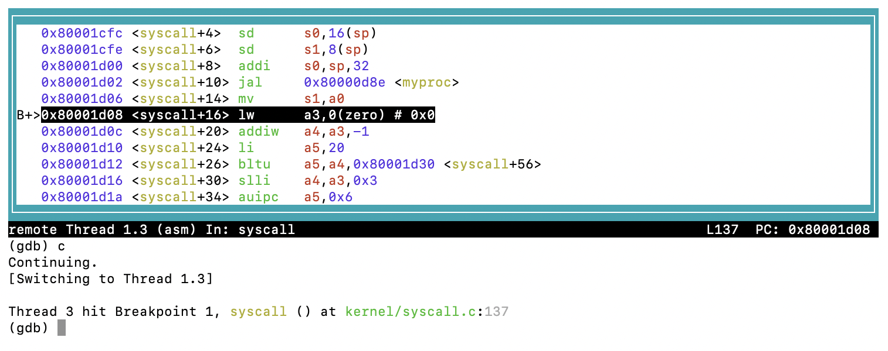

### labs
```bash
git fetch upstream
git checkout -b pgtbl upstream/pgtbl
git checkout -b traps upstream/traps
git checkout -b vm upstream/vm


git push origin syscall
```

tools
```bash
brew install gdb
gdb kernel/kernel
```

### Q2
Q2. What is the value of p->trapframe->a7 and what does that value represent?

A2. 0xf, which represents the syscall number 15: SYS_open,
user program load the syscall number into register a7 then execute ecall instruction.

Hint: look at user/init.c, the first user program xv6 starts, and its compiled assembly user/init.asm.

kernel/syscall.h 
```c
#define SYS_open 15
```
user/init.c
```c
open("console", O_RDWR);
```

user/init.asm
```asm
00000000000003b4 <open>:
.global open
open:
 li a7, SYS_open
 3b4:	48bd                	li	a7,15
 ecall
 3b6:	00000073          	ecall
 ret
 3ba:	8082                	ret
```

kernel/syscall.c
```c
num = p->trapframe->a7;
```

### Q3
[riscv-privileged](../papers/riscv-privileged-20211203.pdf)

4.1.1 Supervisor Status Register (sstatus)
- SPP (Supervisor Previous Privilege)
- SPP = 0 User mode before trap
- SPP = 1 Supervisor mode before trap
```bash
(gdb) p /x $sstatus
$2 = 0x8000000200006022
```

ref Figure 4.2: sstatus when SXLEN = 64
```
0x8000000200006022
lower 16bit: 0x6022
1hex = 4 bit:
6=0110
0=0000
2=0010
  bit            8 7654 3210       
0x6022 = 0110 0000 0010 0010
         ^^^^ ^^^^ ^^^^ ^^^^
          6    0    2    2
bit8 = 0
SPP  = 0
```

### Q4
The xv6 kernel code contains consistency checks whose failure causes the kernel to panic; you may find that your kernel modifications cause panics. For example, 
```c
❌ DO NOT USE IDE FORMAT!!!
Use vim!!!
vim kernel/syscall.c
replace the statement 
num = p->trapframe->a7; 
with 
num = * (int *) 0;
```
 at the beginning of syscall, run make qemu, and you will see something similar to:
```bash
make clean
make qemu

xv6 kernel is booting

hart 2 starting
hart 1 starting
scause=0xd sepc=0x80001d08 stval=0x0
panic: kerneltrap
```

kernel.asm
```asm
  num = * (int *) 0;
    80001d08:	00002683          	lw	a3,0(zero) # 0 <_entry-0x80000000>
```
### Q5
To inspect the state of the processor and the kernel at the faulting instruction, fire up gdb, and set a breakpoint at the faulting epc, like this:
```bash
Ctrl+A X
make qemu-gdb
gdb kernel/kernel
b kernel/syscall.c:137
Breakpoint 1 at 0x80001d08: file kernel/syscall.c, line 137.
(gdb) layout asm
(gdb) c
```

```gdb
si
info registers pc
info registers
q
si
si
...
si
```
riscv-privileged:
scause Exception Code
0xd:Load page fault
10a
11b
12c
13d
Supervisor Trap Value (stval) Register

### Q6
```bash
gdb kernel/kernel
...
Reading symbols from kernel/kernel...
The target architecture is set to "riscv:rv64".
0x0000000000001000 in ?? ()
(gdb) b kernel/syscall.c:137
Breakpoint 1 at 0x80001d08: file kernel/syscall.c, line 137.
(gdb) c
Continuing.

Thread 1 hit Breakpoint 1, syscall () at kernel/syscall.c:137
137	  num = * (int *) 0;
(gdb) p myproc()->name
$1 = "init", '\000' <repeats 11 times>
(gdb) p myproc()->pid
$2 = 1
```