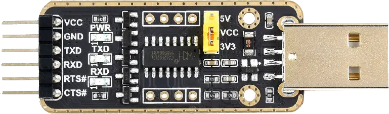

# 01 Start with MilkV-Duo S


## Documents
#### Install CH343 driver first
- Board: [MilkV-Duo S](https://milkv.io/zh/duo-s)
- USB-TTL: [CH343 USB UART Board](https://www.waveshare.net/wiki/CH343_USB_UART_Board)


#### DuoS GPIO Pinout


#### CH343 USB UART Board



## USB-TTL connect to DuoS
Only conect pin in Header J3
| TTL | DuoS |
| --- | --- |
| GND | 6 GND |
| TXD | 10 A17 UART0_RX |
| RXD | 8  A16 UART0_TX |

#### Checkout serial name
```bash
robin@mbp ~  % ls /dev/tty.*
/dev/tty.Bluetooth-Incoming-Port        /dev/tty.wchusbserial5ACB0321921
/dev/tty.debug-console                  /dev/tty.wlan-debug
/dev/tty.usbmodem5ACB0321921
```

#### Try screen
```
screen /dev/tty.wchusbserial5ACB0321921 115200
```
- `screen` exit: `Ctrl+A` then `K` then `Y`
- serial path:   /dev/tty.wchusbserial5ACB0321921
- Baud Rate:     `115200` 115200 bps, 11.5kb/s

DuoS USB-C power on, you should see the boot log.
```
C.SCS/0/0.WD.URPL.USBI.USBEF.BS/EMMC.EMI/25000000/12000000.PS. E:PARAM1 magic (0x0)
PS. E:PARAM1 magic (0x0)
PS. E:PARAM1 magic (0x0)
PS. E:PARAM1 magic (0x0)
PS. E:PARAM1 magic (0x0)
PS. E:PARAM1 magic (0x0)
PS. E:PARAM1 magic (0x0)
PS. E:PARAM1 magic (0x0)
 E:Boot failed (8).
 E:RESET:plat/mars/platform.c:114
WD.C.SCS/0/0.WD.URPL.USBI.USBEF.BS/EMMC.EMI/25000000/12000000.PS. E:PARAM1 magic (0x0)
PS. E:PARAM1 magic (0x0)
......
```
## Boot
System Boot setup:
1. BootROM: SoC Inner
2. SPL (mimi booter)
3. U-Boot
4. Kernel
5. Root filesystem

#### First log
```
C.SCS/0/0.WD.URPL.USBI.USBEF.BS/EMMC.EMI/25000000/12000000.PS. E:PARAM1 magic (0x0)
```
1. C = Clock
2. SCS = System Control & Security
3. /0/0 = Error code 0
4. WD = Watchdog
    - If boot loader hang, watchdog will reset Soc
5. URPL = UART PLL(Phase-Locked Loop)
    - UART Output
    - Debug serial init
6. USBI = USB Initialization
    - USB OTG controller: some SoC support USB drive boot
7. USBEF = USB Enumeration Failed
    - Try next boot device
8. BS = Boot Source
9. EMMC = eMMC boot
10. EMI = External Memory Interface
11. /25000000/12000000 = Clock rate
    - 25MHz
    - 12MHz
12. PS = Parameter System
13. PS. E:PARAM1 magic (0x0)
    - No valid boot parameter found

#### Error log
```
 E:Boot failed (8).
 E:RESET:plat/mars/platform.c:114
```
- Boot failed (8)
  - No valid boot device found
  - 8 = BOOT_NO_MEDIA / BOOT_NO_VALID_IMAGE
- RESET:plat/mars/platform.c:114
  - Source code file path and line number